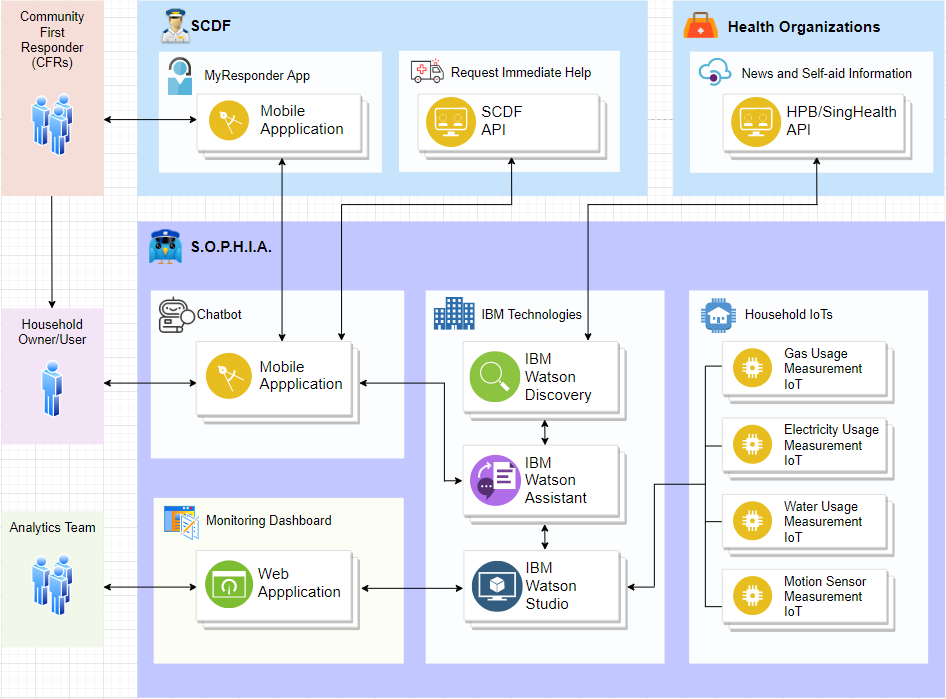

# Kerby-S.O.P.H.I.A._SCDFXIBM
S.O.P.H.I.A. (Safety Officer Personalised Health Intelligence Assistant) is an real-time monitoring system that analyzes dynamic household living data to evoke a cost-efficient and effective response. It aims to call upon early intervention actions as soon as possible to reduce further risks of the vulnerable population and to ease the operating workload of SCDF officers.

## Contents

1. [Short Description of Problem and Proposed Solution](#short-description)
1. [Demo video](#demo-video)
1. [Solution architecture](#the-architecture)
1. [Long Description of Detailed Solution](#long-description)
1. [Project roadmap](#project-roadmap)
1. [Getting started](#getting-started)
1. [Running the tests](#running-the-tests)
1. [Live demo](#live-demo)
1. [Built with](#built-with)
1. [Contributing](#contributing)
1. [Versioning](#versioning)
1. [Authors](#authors)
1. [License](#license)
1. [Acknowledgments](#acknowledgments)

## Short description

### What's the problem? 

Problem Statement Chosen: Emergency Medical Services

A bulk of SCDF's inbound calls are related to the Emergency Medical Services. At a staggering number of 191,468 calls (~98% of Total calls; where Total calls = EMS + Fire Incidents), our team decide to create a solution around EMS to ease SCDF's operating workload. Calls which involved the elderly population attributed to 43.8% of total EMS calls. This is no surprise as Singapore is currently experiencing an upward trending growth in the aging population. A portion of the aging population are "vulnerable populations" (e.g. without a next of kin), which highlights an emergence of higher risk within households.

### How can technology help?

By capturing data of household and homeowner activity, we are able to monitor the personalised baseline patterns during normal times. If there is a divergence from such normality, an investigative procedure will be performed. With a well connected infrastructure, the system is able to find appropriate measures for self-aid resources or to alert Community First Responders (CFRs) to enlist their help. 

Depending on the magnitude of divergence from an established baseline, the system will allocate different level of severities. In non-severe cases, the situation will be highlighted to the relevant parties (e.g. next-of-kin, CFR, social workers). They can then act as an early intervention measure to prevent the escalation of injury/accident risk. In highly severe cases, the system will inform the SCDF or other relevant organisations for immediate attention. 

The aim of this solution is to utlize technology:
1. To analyze the status quo of a given household via data analysis
2. To prevent a high-risk situation by creating opportunities for early intervention as early as possible
3. To remedy different situations with different level of support based on severity

### The idea

In view of the growth in the aging population, it is important that we have to create a safer household for everyone so that their needs are met and they are well supported at all times. This is especially significant in times of crises such as the current COVID-19 pandemic. During our nation's circuit breaker, social interaction is reduced and this poses a huge problem for the aging households without a next-of-kin. In such households, when a high-risk event happens it might already be too late.

Our team proposes S.O.P.H.I.A., a lightweight,

## Demo video

[](https://youtu.be/vOgCOoy_Bx0)

## The architecture



1. Machine Learning is done in IBM Watson Studio (see long description for details)
2. Other Health Organizations and SCDF's APIs are assumed to be available in this solution (see long description for justification)
3. The Analytics Team refer to any team that is authorized to monitor and analyze the user data provided by the Machine Learning Model.
4. The Household IoTs are as the name suggests, they measure the usage of resources. Motion sensors monitors movement in the kitchen. The rationale behind this is to prevent fires from unwatched stoves.

## Long description

[Click here to view detailed explanation](LONGDESCRIPTION.md)

## Project roadmap


## Getting started
These instructions will get you a copy of the project up and running on your local machine for development and testing purposes. There is no Prerequisites or Installing required to run the chatbot. Just click on the following preview link to start:

## Running the tests

### Testing for issues regarding pain in the limbs
1. User can type into the chatbot "I am experiencing some pain in my legs"
2. The chatbot will respond with "I am sorry to hear that. Has the pain persisted longer than 2 days?"
3. The user should give a "yes" or "no" reply.
   - If the user replies with "yes", the bot will reply the user with "I see. I would advice you to head to your nearest GP to seek medical treatment. Do take note of any medication that you have taken in the past 24 hours and if you have any drug allergies."
 4. If the user replies "no", the chatbot will then ask "I see. In that case, are you facing any 2 out of the 3 following conditions? 1) Weakness 2) Numbness 3) Result of an Injury".
    - If the user replies "yes", the chat bot will then respond with "Ahh okay. In this case, I would advice you to head to your nearest GP to see a doctor. Do take note of any medication that you have taken in the past 24 hours and if you have any drug allergies."
    - If the user replies "no", the chat bot will respond with "Okay. If you are not feeling a combination of any of those symptoms, you are okay. Please continue to monitor your pain and alert me if there is any new development with your pain. For now, please stay home and rest."

### Testing for chest pain related issues
1. The user can type into the chatbot "I have some discomfort in my chest"
2. The chatbot will respond with "Are you experiencing breathlessness, chest pain, as well as cold sweat?"
3. The user should give a "yes" or "no" reply.
   - If the user replies with "yes", the bot will reply the user with "Alright. I have notified a nearby CFR to attend to you immediately. Please remain calm and try to stay seated in the upright position."
   - If the user replies with "no", the bot will reply the user with "I see. In that case, I would advice you to rest at home until the discomfort goes away. If the pain gets worse or if there is any new development, please let me know."
   
### Testing for cut related issues
1. The user can type into the chatbot "I have just cut myself"
2. The chatbot will respond with "I'm sorry to hear that. Was it due to an animal bite or caused by a rusty nail?"
3. The user should give a "yes" or "no" reply.
   - If the user replies with "yes", the bot will reply the user with "Please visit the GP closes to you to disinfect the cut. "
4. If the user replies with "no", the bot will reply the user with "Do you feel feverish and is there redness, swelling, pain and pus formation developing on the cut?"
   - If the user replies with "yes", the bot will reply the user with "Please head down to the nearest GP. Do take note of any medication you have taken in the past 24 hours."
   - If the user replies with "no", the bot will reply the user with "Please rest at home and continue to monitor your cut. If it continues to bleed or if there is any new development, please let me know."
   
### Testing for Nausea and Vomiting related issues
1. User can type into the chatbot ‘I am feeling nauseous’
2. Chatbot will respond with "Oh no. Do you have severe abdominal pain or was the vomiting caused by a head injury?"
3. The user should give a "yes" or "no" reply.
   - If the user replies with "yes", the bot will reply the user with "Please head down to the A&E to seek immediate medical attention. Please take note of any medication you have taken in the last 24 hours and take note of any drug allergies you may have."
4. If the user replies with "no", the bot will reply the user with "Are you exhibiting signs of dehydration such as extreme thirst, light headedness and a dry mouth?"
   - If the user replies with "yes", the bot will reply the user with "Please head down to the nearest GP. Do take note of any medication you have taken in the past 24 hours."
5. If the user replies with "no", the bot will reply the user with "Has the vomiting been persisting for a few hours or have you developed abdominal pain or diarrhoea?"
   - If the user replies with "yes", the bot will reply the user with "Please seek medical attention at your nearest GP. Don't forget to take note of any medication you have taken in the past 24 hours and if you have any drug allergies."
   - If the user replies with "no", the bot will reply the user with "Please rest at home and continue to monitor your nausea. If it gets worse or if there is any new development, please let me know."
   
### What to do before the Ambulance arrives :
1. User can alert the chatbot that they have contacted an ambulance by typing something like ‘I have called an ambulance’ into the chatbot.
2. Chatbot will respond with a query to extract more information from the user. Examples of such quaries are as follows:
   - "Oh. What's wrong?"
   - "I see. May I ask what made you want to call an ambulance."
   - "I hope you are okay. Why did you decide to call an ambulance?"
3. User can choose to enter a responce that is related to ‘giddiness’, ‘spine injury’, or ‘difficulty breathing’
4. If the user has entered a responce that is related to ‘giddiness’, the chatbot will reply with "Oh I see. In that case, please drink something sweet and remain seated. This will help to reduce the giddiness."
5. If the user has entered a responce that is related to ‘spine injury’, the chatbot will reply with "Oh no. I would advice you to avoid twisting your back and stay as still as possible. This will help reduce the chance of the injury getting worse."
6. If the user has entered a responce that is related to ‘difficulty breathing’, the chatbot will reply with "I see. Please remain seated in an upright position if you are still facing chest related issues. Please try to remain calm."

### Looking for Emotional support :
1. User can type an emotional statement into the chatbot such as ‘I am feeling sad’
2. Chatbot will reply with a query to extract more information from the user. Examples of such quaries are as follows:
    - "Oh no. What made you feel that way?"
    - "I understand what you are going through. Please tell me more."
    - "Please share with me more about how you feel."

### Break down into end to end tests

Explain what these tests test and why, if you were using something like `mocha` for instnance

```bash
npm install mocha --save-dev
vi test/test.js
./node_modules/mocha/bin/mocha
```

### And coding style tests

Explain what these tests test and why, if you chose `eslint` for example

```bash
npm install eslint --save-dev
npx eslint --init
npx eslint sample-file.js
```

## Live demo

You can find a running system to test at [callforcode.mybluemix.net](http://callforcode.mybluemix.net/)

## Built with

* [IBM Cloudant](https://cloud.ibm.com/catalog?search=cloudant#search_results) - The NoSQL database used
* [IBM Cloud Functions](https://cloud.ibm.com/catalog?search=cloud%20functions#search_results) - The compute platform for handing logic
* [IBM API Connect](https://cloud.ibm.com/catalog?search=api%20connect#search_results) - The web framework used
* [Dropwizard](http://www.dropwizard.io/1.0.2/docs/) - The web framework used
* [Maven](https://maven.apache.org/) - Dependency management
* [ROME](https://rometools.github.io/rome/) - Used to generate RSS Feeds

## Contributing

Please read [CONTRIBUTING.md](CONTRIBUTING.md) for details on our code of conduct, and the process for submitting pull requests to us.

## Versioning

We use [SemVer](http://semver.org/) for versioning. For the versions available, see the [tags on this repository](https://github.com/your/project/tags).

## Authors

* **Billie Thompson** - *Initial work* - [PurpleBooth](https://github.com/PurpleBooth)

See also the list of [contributors](https://github.com/Code-and-Response/Project-Sample/graphs/contributors) who participated in this project.

## License

This project is licensed under the Apache 2 License - see the [LICENSE](LICENSE) file for details

## Acknowledgments

* Based on [Billie Thompson's README template](https://gist.github.com/PurpleBooth/109311bb0361f32d87a2).
